# Bookstore Web Application (Server Side)

This repository contains the server-side implementation of a **Bookstore Web Application**, featuring an interactive **e-book reader** and **audiobook player**. The frontend part of the project can be found [here](https://github.com/eryxmiliaris/bookstore-client).

---

## Table of Contents

1. [Used Technologies](#used-technologies)
2. [Features](#features)
3. [Installation](#installation)
    - [Prerequisites](#prerequisites)
    - [Configuration](#configuration)
    - [Steps to Run](#steps-to-run)
4. [Default Users](#default-users)
5. [Swagger Documentation](#swagger-documentation)
6. [Screenshots](#screenshots)

---

## Used Technologies

- **Spring** (Boot, Data JPA, Security)
- **Hibernate**
- **Maven**
- **MySQL**
- **JWT**
- **REST API**

---

## Features

1. **Authentication and Authorization**: Secure user authentication and authorization using JWT tokens.
2. **RESTful API Endpoints**: Well-defined API endpoints for integration with the frontend and third-party services.
3. **E-book Reader and Audiobook Player**: Interactive e-book reader and audiobook player with customizable settings. Reading progress is saved on the server, so users can pick up where they left off, no matter which device they are using.
4. **Book Catalogue**: Catalogue of paper books, e-books and audiobooks with different search criteria, such as title, book types, categories and price range.
5. **Reviews**: User reviews and ratings for books to help people decide whether to buy a book.
6. **Wishlist and Cart**: Wishlist and shopping cart functionalities for users to save desired items and make checkout process easier.
7. **Payments**: Integration with the PayPal Sandbox system for secure payment processing.
8. **Order History**: Order history for users to track past purchases.
9. **Library**: Digital library feature for storing and organizing purchased e-books and audiobooks, providing easy access to content across devices.
10. **Admin Panel**: an admin panel serves as a control center for managing book listings, user orders and reviews.

---

## Installation

### Prerequisites

- Install **Java 17**.
- Install **Docker Compose**.

### Configuration

1. **Database Configuration**:
    - Update the `database/docker-compose.yml` properties if needed.
    - In `application.properties`, update the following properties if necessary:
        - `spring.datasource.url`
        - `spring.datasource.username`
        - `spring.datasource.password`
        - `bookstore.file.directory` (path to the folder where uploaded files will be saved)
        - `bookstore.client.base.url`

2. **Initial Dataset Configuration**:
    - Modify variable paths in `database/initialData.sql` to ensure the test dataset works as expected (`@coverImagePath`, `@bookFilePath`, `@previewFilePath`, etc.).
    - Test files are located in the `database` folder.

### Steps to Run

1. Start the database container:
   ```bash
   docker-compose up -d  
   docker exec -i bookstore-database mysql -u root -p1234 bookstore < initialData.sql  
   ```  

2. (Optional) **Enable PayPal Sandbox Service**:
    - Provide your PayPal sandbox `clientId` and `clientSecret` in `bookstore/src/main/resources/application.properties`.
    - Uncomment lines 73–81 in `bookstore/src/main/java/com/vb/bookstore/services/impl/OrderServiceImpl.java`.

3. (Optional) **Enable Forgot Password Feature**:
    - Update the Gmail SMTP `username` and `password` in the `application.properties` file.

4. Start the server from the project root folder:
   ```bash
   mvnw spring-boot:run  
   ```  

5. Install and start the frontend client: [Frontend Repository](https://github.com/eryxmiliaris/bookstore-client).

---

## Default Users

| **Role**       | **Login**     | **Password** |  
|-----------------|---------------|--------------|  
| Admin          | `admin`       | `admin`      |  
| User With Subscrition | `usersub`     | `user`       |  
| Regular User    | `usernosub`   | `user`       |  

---

## Swagger Documentation

To access the Swagger documentation, visit:  
[http://localhost:8080/swagger-ui/index.html](http://localhost:8080/swagger-ui/index.html).
- Enter `/api-docs` in the search bar and click "Explore".

---

## Screenshots

Catalogue  |  Book page
:------------------------:|:-------------------------:
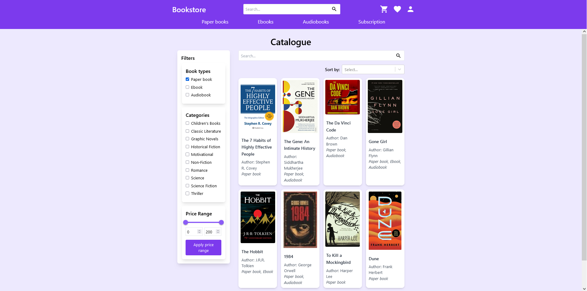  |  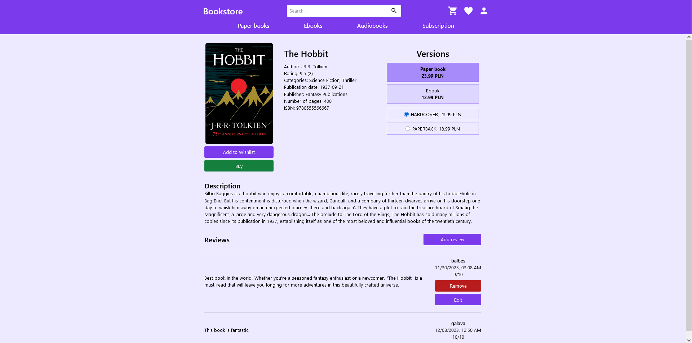

Wishlist  |  User profile
:------------------------:|:-------------------------:
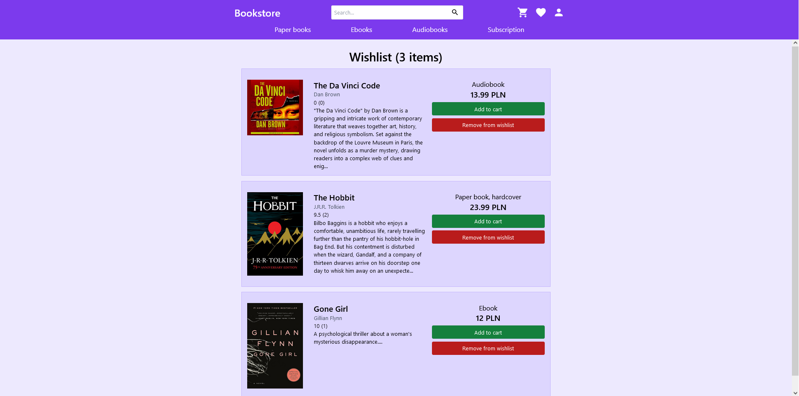  |  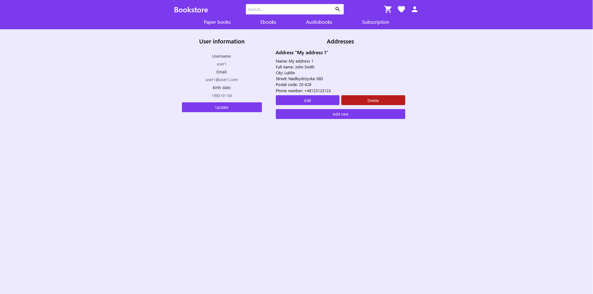

Cart page  |  Library
:------------------------:|:-------------------------:
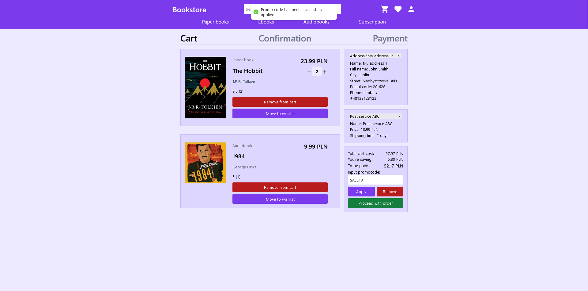  |  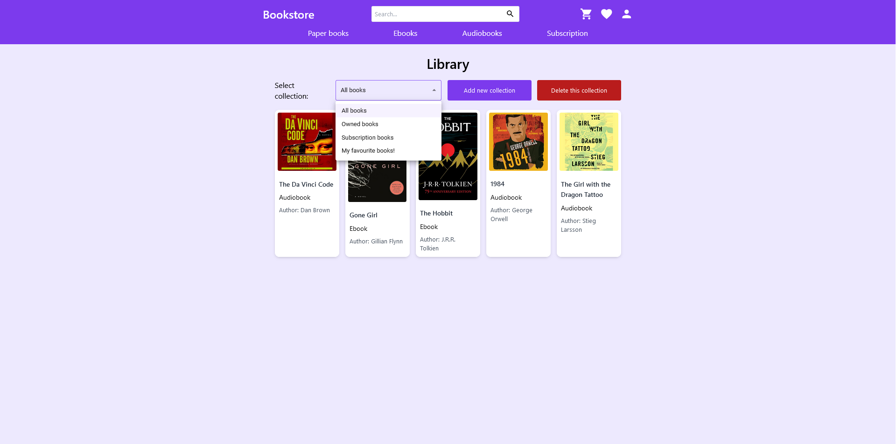

Order history page  |  Audiobook player
:------------------------:|:-------------------------:
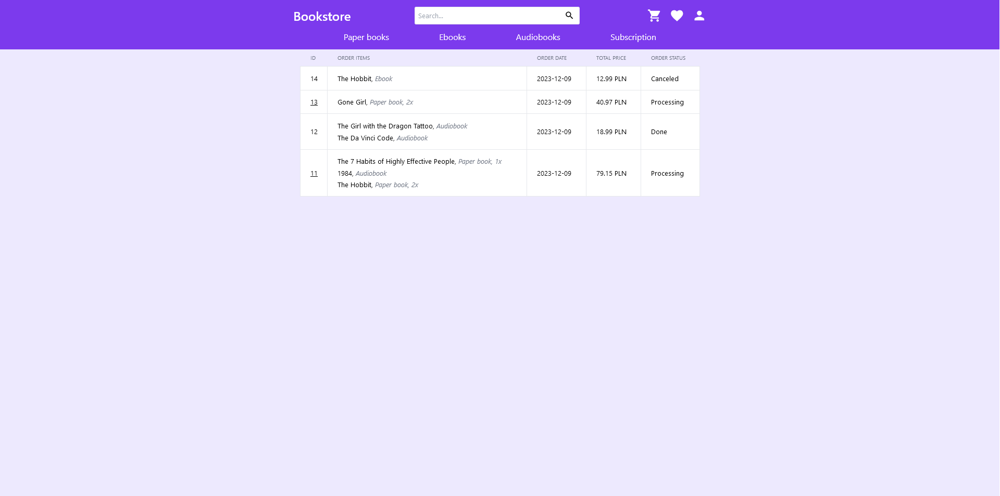  |  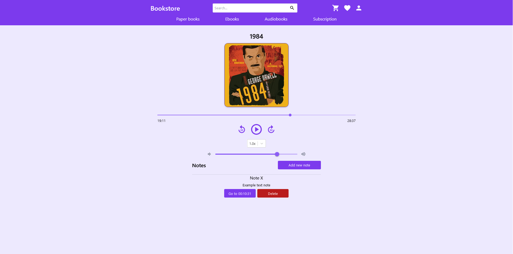

Ebook reader  |  Ebook reader with dark theme
:------------------------:|:-------------------------:
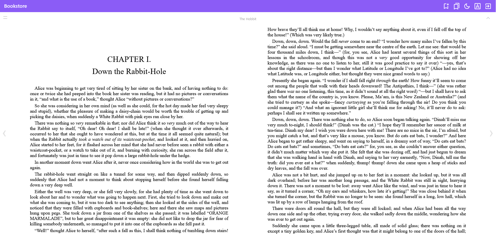  |  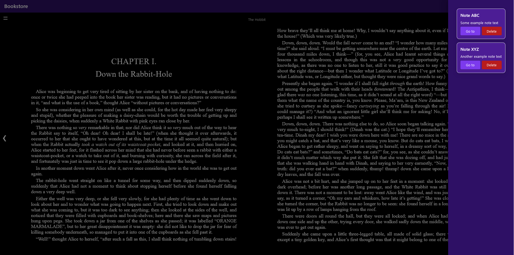

Add book page  |  Edit book page
:------------------------:|:-------------------------:
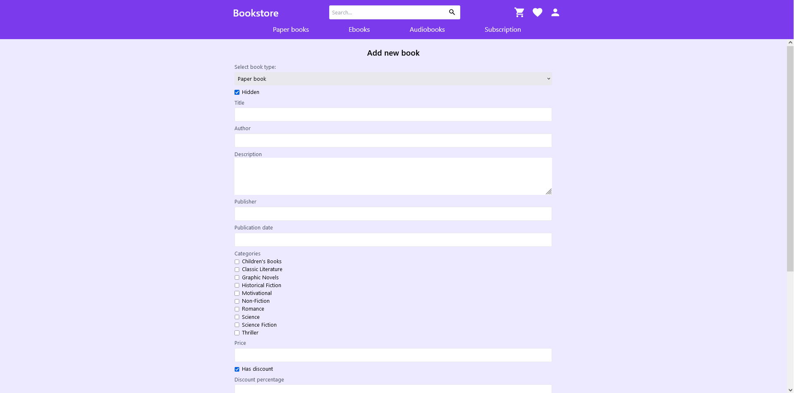  |  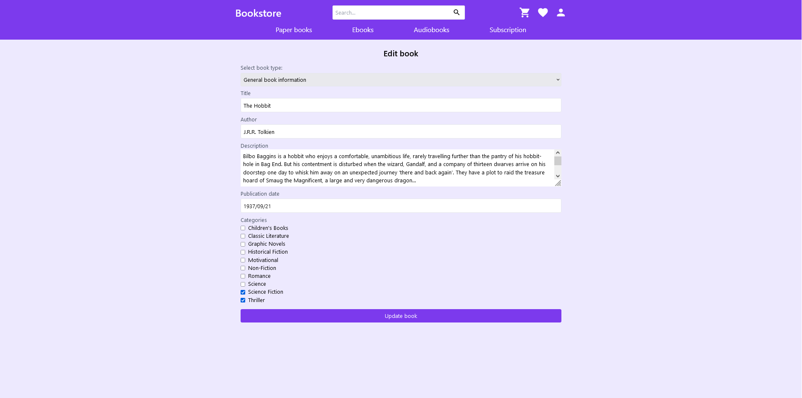